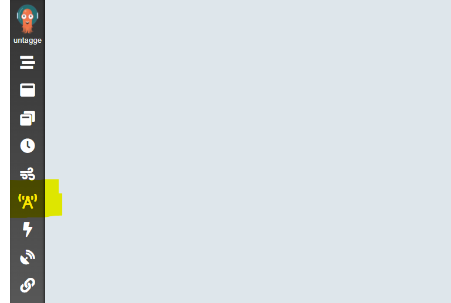
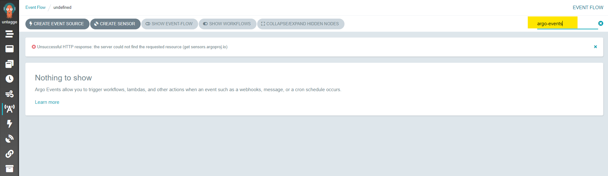

Veuillez patienter en attendant que nous installions les éléments suivants :
Nginx Ingress Controller
Argo Server

Tout d'abord, nous allons nous authentifier auprès de Argo Server. Rafraichissez la fenêtre supérieure (lien Try Again ou bouton Display Port). Exécutez la ligne ci après.

`clear && kubectl exec $(kubectl get pods -l app=argo-server -o=jsonpath='{.items[0].metadata.name}') -- argo auth token && printf "\n\n"`{{execute HOST1}}

et copiez / collez le résultat ("Bearer xxx...xxx...") dans la case du milieu  (argo auth token), puis cliquez sur login.
Fermez les deux fenêtres d'information et cliquez sur "Event Flow".

Dans la ligne de commande de droite, modifiez le namespace "undefined" pour "argo-events". Validez avec entrée.

Pour commencer, nous allons installer ArgoEvents, depuis les fichiers officiels, dans son propre namespace (que nous avons préalablement créé) :
`kubectl get namespace argo-events`{{execute HOST1}}

Argo Events pour s'installer simplement à partir du manifeste officiel :
`kubectl apply --filename https://raw.githubusercontent.com/argoproj/argo-events/stable/manifests/install.yaml`{{execute HOST1}}

Ce manifeste créé les CRDs Argo Events, les Services Account nécessaires, Les ClusterRoles, et les trois controlleurs : Sensor Controller, EventBus Controller and EventSource Controller.

Installons aussi l'eventbus, afin de permettre la circulation des évènements au sein du système :

`kubectl --namespace argo-events apply --filename https://raw.githubusercontent.com/argoproj/argo-events/stable/examples/eventbus/native.yaml
`{{execute HOST1}}

Il est temps de créer notre premier évènement, en utilisant le pattern le plus simple à comprendre, le webhook.
