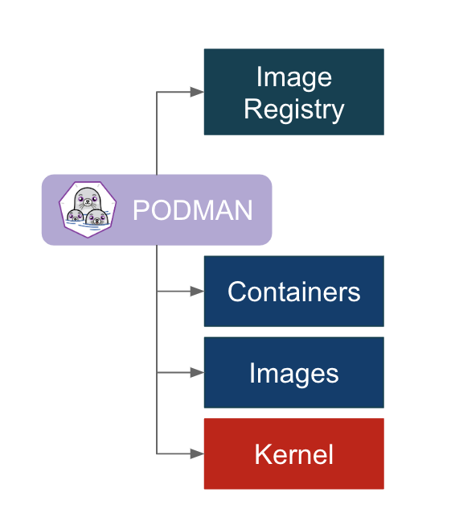

Bienvenue dans ce cours **[PODMAN](https://podman.io)** !

**C'est quoi le PODMAN**

Voici la définition dans la documentation de l'outil:  [https://docs.podman.io/en/latest/index.html](https://docs.podman.io/en/latest/index.html): "Podman is a **daemonless**, **open source**, **Linux native tool** designed to make it easy to **find**, **run**, **build**, **share** and **deploy** applications using **Open Containers Initiative (OCI)** Containers and **Container Images**." 

 . 