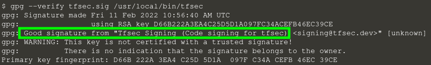

Il existe plusieurs façons d'installer **TFSec** (brew,choco, scoop). Pour ce tutoriel nous allons directement télécharger le binaire.

# Installer le binaire TFSec

Téléchargez le binaire de TFSec et accordez lui les droits d'exécution :
<<<<<<< HEAD
`curl -o /usr/local/bin/tfsec -L -J -O https://github.com/aquasecurity/tfsec/releases/download/v1.0.2/tfsec-linux-amd64 && chmod u+x /usr/local/bin/tfsec`{{execute}}
=======
`curl -o /usr/local/bin/tfsec -L -J -O https://github.com/aquasecurity/tfsec/releases/download/v1.1.5/tfsec-linux-amd64 && chmod u+x /usr/local/bin/tfsec`{{execute}}
>>>>>>> 763f617dc53de4783109874c266e710746065bc9

Vérifiez que TFSec est bien installé :
`tfsec --version`{{execute}}

Vous devriez obtenir :
```
$ tfsec --version
<<<<<<< HEAD
v1.0.2
```
=======
v1.1.5
```

# Vérifier le binaire TFSec

Tous les fichiers binaires TFSec sont signés avec une clé. Cela nous permet de vérifier l'authenticité de notre binaire.

Téléchargez la clé publique de la signature :
`curl -o /tmp/tfsec_key.txt -L -J -O https://aquasecurity.github.io/tfsec/v0.63.1/assets/signing.asc`{{execute}}

Importez la dans GPG :
`gpg --import < /tmp/tfsec_key.txt`{{execute}}

Téléchargez le fichier de signature de la clé associé à la version :
`curl -o /tmp/tfsec.sig -L -J -O https://github.com/aquasecurity/tfsec/releases/download/v1.1.5/tfsec-linux-amd64.D66B222A3EA4C25D5D1A097FC34ACEFB46EC39CE.sig`{{execute}}

Vérifiez la signature :
`gpg --verify /tmp/tfsec.sig /usr/local/bin/tfsec`{{execute}}

Vous devriez obtenir le résultat suivant :


>>>>>>> 763f617dc53de4783109874c266e710746065bc9
