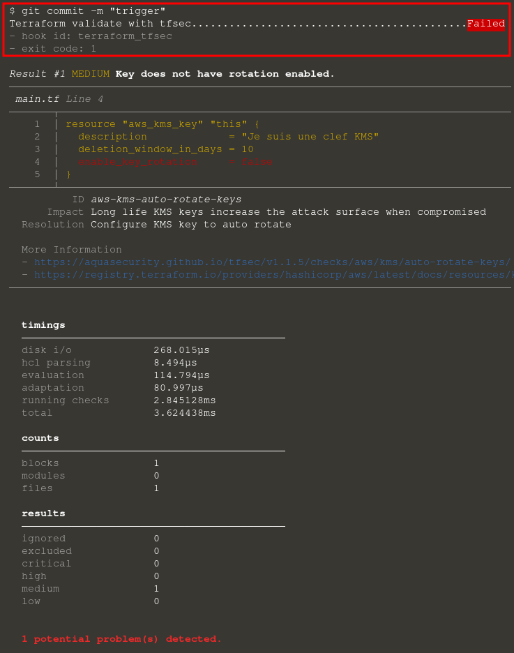
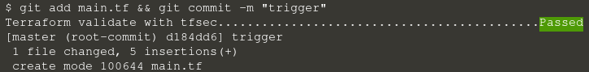

Ajoutez à l'index Git le fichier `main.tf` :

`git add main.tf`{{execute}}

Pour rappel le but de pre-commit est de nous empêcher de commit si le retour de l'un de nos hooks est négatif. Essayez de commit :

`git commit -m "trigger"`{{execute}}

Vous devriez obtenir ce résultat :

Vous devriez rencontrer un échec car le hook TFSec de pre-commit détecte des problèmes de sécurité.

> **Astuce** : Vous pouvez déclencher vos hooks en invoquant directement Pre-commit. Pratique lorsque l'on veut tester la configuration des hooks sans commiter des fichiers :

`pre-commit run terraform_tfsec`{{execute}}

## Corriger le problème

Pour corriger le problème détecté par pre-commit remplacez la valeur de la directive **enable_key_rotation** à **true** :

`sed -i 's/false/true/' main.tf`{{execute}}

Vérifiez que le problème est bien corrigé :

`git add main.tf && git commit -m "trigger"`{{execute}}

Vous devriez obtenir ce résultat :

Si **Pre-commit** ne bloque pas , c'est réussi !